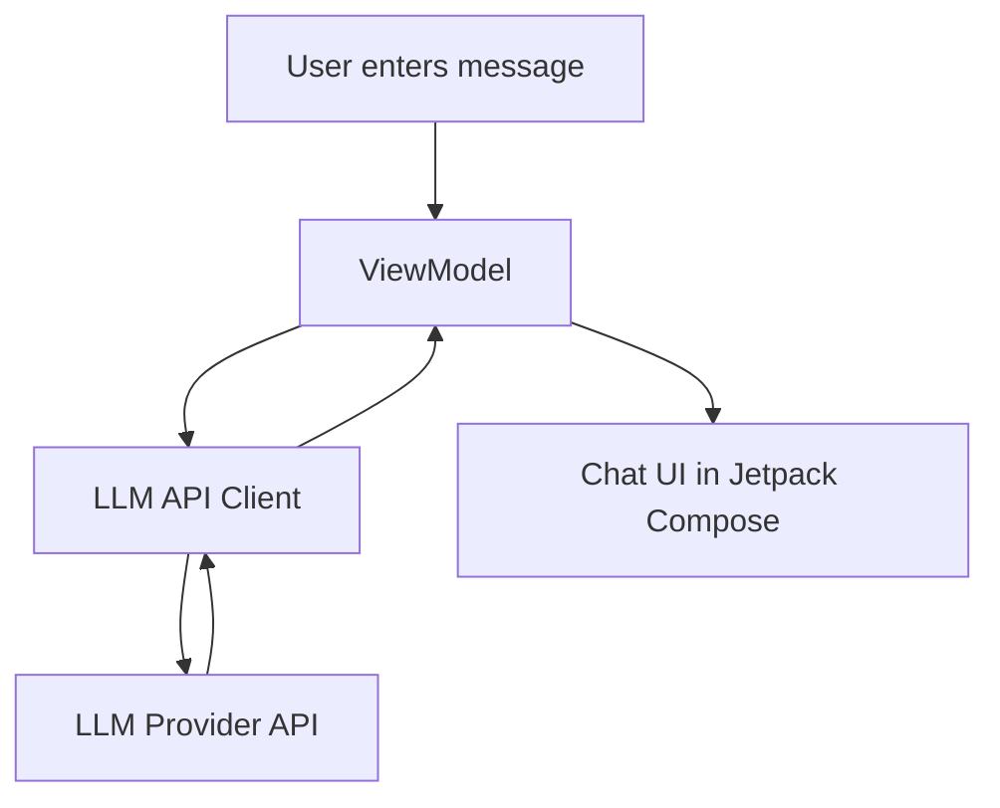

# Android LLM UI App 

A simple Android app that provides a clean **chat UI** for interacting with Large Language Models (LLMs). It’s designed as a starter template you can point at any backend (cloud or local) and quickly prototype an AI chat experience on Android.

## Features

- **Chat-based UI** built with Jetpack Compose  
- **Message history** maintained in a scrollable list  
- **LLM backend integration** (connect to Gemini, OpenAI, or your own API)  
- **Asynchronous requests** using Kotlin Coroutines  
- **MVVM architecture** with ViewModel and state handling  
- **Easily customizable** for styling and adding new model endpoints

## Tech Stack

- **Language**: Kotlin  
- **UI**: Jetpack Compose  
- **Architecture**: MVVM (Model–View–ViewModel)  
- **Networking**: Retrofit / OkHttp (or your chosen SDK for LLM API)  
- **Async**: Kotlin Coroutines & Flows  
- **Build System**: Gradle (Android Studio)

## Requirements

- **Android Studio** (latest stable release)  
- **Android SDK** 23+ (Marshmallow and above)  
- **Kotlin** 1.8+  
- **An API key** for your chosen LLM provider (e.g., Gemini, OpenAI, or custom backend)  
- A device or emulator with internet access

##  Setup & Installation

1. **Clone the repository**
   ```bash
   git clone https://github.com/ananya101001/Android-LLM-UI-App.git
   cd Android-LLM-UI-App
   ```

2. Open in Android Studio

  1. Launch **Android Studio**  
  2. Select **Open Project** and choose this folder  
  3. Let Gradle sync and install dependencies  

---

## Configure API Key

1. Obtain an API key from your chosen LLM provider (e.g., Gemini or OpenAI)  
2. Add it to your `local.properties` or a safe config file (⚠️ do not commit this to Git):  

```properties
LLM_API_KEY=your_api_key_here
```

##  Run the App

1. Connect a physical device or start an Android emulator  
2. In Android Studio, click **Run** ▶️  
3. The app will launch, and you can start chatting with the LLM 🎉  

## Core Implementation (High Level)

- **User enters a prompt** in the chat input  
- **ViewModel** sends the request to the LLM API client  
- **LLM API** processes the prompt and generates a response  
- **Response** is parsed and returned to the ViewModel  
- **UI (Jetpack Compose)** updates automatically to display the conversation  




